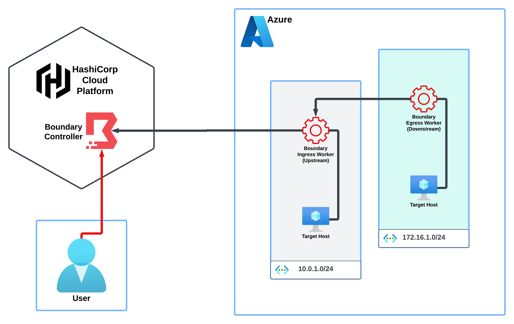

# HCP LEARN BOUNDARY - AZURE


## PREREQS
- HCP Boundary
  - Org Level Service Principal
- Boundary CLI Client
- Azure
- Terraform

## OVERVIEW

[](https://developer.hashicorp.com/boundary/tutorials/hcp-administration/hcp-manage-multi-hop)

## INPUTS
##### Environment Variables
```shell
# // HCP CLOUD SERVICE PRINCIPAL
export HCP_CLIENT_ID=
export HCP_CLIENT_SECRET=
# // BOUNDARY
export BOUNDARY_ADDR=
export BOUNDARY_AUTH_METHOD_ID=
# // BOUNDARY PROVIDER INPUT VARIABLES
export TF_VAR_boundary_addr=
export TF_VAR_auth_method_id=
export TF_VAR_auth_method_login_name=
export TF_VAR_auth_method_password=
```

## STEPS
#### Terraform
```shell
terraform init
terraform plan
terraform apply
```
#### Connect to Target
```shell
boundary authenticate
boundary connect ssh -target-id=$TARGET_ID -host-id=$HOST_ID -- -v
boundary connect ssh -target-id=tssh_1234567890 -host-id=hst_1234567890
```


## REFERENCES
##### AZURE
- https://registry.terraform.io/modules/Azure/virtual-machine/azurerm/latest
- https://learn.microsoft.com/en-us/azure/virtual-machines/linux/quick-create-terraform

##### BOUNDARY
- https://github.com/markchristopherwest/boundary-session-recording
- https://tekanaid.com/posts/hashicorp-boundary-make-sure-your-human-to-machine-access-is-secure
- https://github.com/samgabrail/boundary-intro
- https://youtu.be/pGfSITzcTQ0

##### CONFIG TERRAFORM
- https://developer.hashicorp.com/boundary/tutorials/hcp-administration/hcp-manage-intro
- https://developer.hashicorp.com/boundary/tutorials/oss-administration/oss-manage-intro
- https://developer.hashicorp.com/boundary/tutorials/hcp-administration/hcp-manage-scopes
- https://developer.hashicorp.com/boundary/tutorials/oss-administration/oss-manage-scopes
- https://developer.hashicorp.com/boundary/tutorials/hcp-administration/hcp-manage-targets
- https://developer.hashicorp.com/boundary/tutorials/oss-administration/oss-manage-targets
- https://developer.hashicorp.com/boundary/tutorials/hcp-administration/hcp-manage-users-groups
- https://developer.hashicorp.com/boundary/tutorials/oss-administration/oss-manage-users-groups
- https://developer.hashicorp.com/boundary/docs/common-workflows/manage-users-groups
- https://developer.hashicorp.com/boundary/tutorials/hcp-administration/hcp-manage-roles
- https://developer.hashicorp.com/boundary/tutorials/oss-administration/oss-manage-roles
- https://developer.hashicorp.com/boundary/docs/concepts/security/permissions#permission-grant-formats
- https://developer.hashicorp.com/boundary/tutorials/hcp-administration/hcp-ssh-cred-injection
- https://developer.hashicorp.com/boundary/tutorials/hcp-administration/hcp-ssh-cred-injection
- https://www.hashicorp.com/resources/understanding-the-power-of-hashicorp-boundary-ssh-credential-vault-multi-hop
- 

##### BOUNDARY WORKER
- https://developer.hashicorp.com/boundary/tutorials/hcp-administration/hcp-manage-workers
- https://developer.hashicorp.com/boundary/docs/configuration/worker
- 

##### MISC
- https://gist.github.com/nicholasjackson/cff881edcd3e31aecb665dfc73562de2
- https://developer.hashicorp.com/terraform/language/functions/split
- https://learn.microsoft.com/en-us/azure/virtual-machines/instance-metadata-service?tabs=linux
- 

## APPENDIX
### APPENDIX A: Azure VM Metadata
```shell
curl -s -H Metadata:true --noproxy "*" "http://169.254.169.254/metadata/instance?api-version=2021-02-01" | jq
```

## AKNOWLEDGEMENTS
Thanks for your help **[@markchristopherwest](https://github.com/markchristopherwest/boundary-session-recording "@markchristopherwest")**
